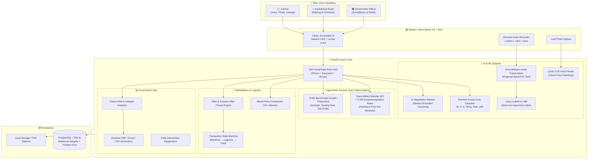

# 🌾 FasalSetu (फसल सेतु)
### *Bridging the Gap Between Farmers, Fair Markets, and Smart Agriculture*

[](https://fastapi.tiangolo.com/)
[](https://reactjs.org/)
[](https://vitejs.dev/)
[](https://tailwindcss.com/)
[](https://groq.com/)
[](https://scikit-learn.org/)
[](LICENSE)

---

## 📖 The Story: Why We Built FasalSetu

In India, over 140 million families depend on farming for their livelihoods. Yet, the average farmer still makes critical, high-stakes decisions largely by intuition, tradition, or word-of-mouth:

- **Guesswork at Sowing Time**: Farmers plant what their neighbors are planting, without knowing if their soil's Nitrogen, Phosphorus, Potassium (N-P-K), pH, and local seasonal rainfall actually suit that crop. When the harvest underperforms, debt follows.
- **The Middleman Trap**: When harvest arrives, local commission agents (*arhtiyas*) often dictate arbitrary prices. Farmers lack real-time price transparency across nearby *mandis* (agricultural markets) and end up selling at distress rates.
- **Language & Literacy Barriers**: Traditional agriculture apps are text-heavy, complicated, and written in English. When a leaf turns yellow or gets attacked by pests, the farmer needs instant advice in their mother tongue—preferably by speaking or snapping a photo, not filling out 15-field forms.
- **Water Uncertainty**: Over-watering drowns roots and wastes groundwater; under-watering ruins yields. Expensive IoT soil sensors cost thousands of rupees that smallholders simply cannot afford.
- **Government Blind Spots**: State agricultural departments often discover pest epidemics and crop failures weeks after they happen, when regional devastation is already irreversible.

**FasalSetu ("Crop Bridge")** was built to solve these exact problems. It is an end-to-end, human-first digital agriculture ecosystem connecting **Farmers**, **Institutional Buyers**, and **Government Agricultural Officers** in one unified, real-time platform.

---

## 💡 Our Solution at a Glance

FasalSetu removes the friction and unfairness from farming through five core pillars:

1. **Intelligent Planting**: A trained Machine Learning model predicts the highest-yielding crop for the farmer's specific soil chemistry and climate, plus safe alternative choices.
2. **True Market Transparency**: Farmers can compare live crop rates across multiple regional mandis and find the highest paying market before loading their tractor.
3. **Voice & Vision AI Doctor**: Farmers can speak in Hindi, Telugu, or English, or simply snap a photo of a diseased leaf. Our AI diagnoses the problem in seconds and gives clear, organic or chemical remedies with safety tips.
4. **Direct, Fair Marketplace**: Farmers list their harvest and negotiate directly with verified institutional buyers. An AI Negotiation Coach helps farmers make smart counter-offers so they never get lowballed.
5. **Government Command Center**: Regional agricultural officers get live spatial heatmaps of crop health, early warnings for pest clusters, intervention management tools, and instant downloadable PDF/Excel surveillance reports.

---

## 🧠 The Technical Approach: How It Works Under the Hood

We built FasalSetu with a strict design philosophy: **Use AI where intelligence and empathy are needed, but use deterministic mathematics where accuracy and safety are paramount.**



### 1. Dual AI Strategy: High Speed & High Reliability
- **Audio to Regional Text**: Voice notes are processed via Groq's `whisper-large-v3-turbo` with strict 15-second timeouts. This handles noisy farm field audio in local accents effortlessly.
- **Agronomic Advisor with Context Memory**: Groq `llama-3.1-8b-instant` answers agronomic questions in the farmer's native tongue. If the farmer asks a follow-up ("How much spray per acre?"), the backend maintains conversational session history (up to 3 prior turns) so the conversation flows naturally.
- **Vision Disease Diagnosis**: Farmers upload a leaf photo. A 27B multimodal vision model scans the foliage, identifies fungal spots, blights, or pest infestations, and returns an immediate breakdown: Disease Name, Severity, Immediate Action, and Organic/Chemical remedy.
- **AI Negotiation Coach**: When a buyer submits an offer on a farmer's crop, the AI coach checks historical mandi rates for that state and provides tactical advice: *"Buyer offered ₹2,100/qtl. Similar mandis in your district are clearing at ₹2,350/qtl. Consider countering at ₹2,280/qtl."*

### 2. Science-Backed Agronomics (No Hallucinations)
- **Zero-Sensor Irrigation Advisory**: Rather than asking farmers to install costly hardware sensors, we query real-time and 7-day forecast weather from Open-Meteo. By factoring in past 72-hour rainfall, temperature, solar radiation, soil drainage constants, and crop-specific daily evapotranspiration rates, we accurately bucket irrigation urgency into `Urgent`, `Monitor`, or `OK`.
- **Yield & Profit Modeling**: Based on Indian Council of Agricultural Research (ICAR) benchmarks, our formula factors in land acreage, sowing date, and local input cost ratios to calculate realistic yield ranges, harvest calendar windows, and estimated net returns.

### 3. Trustworthy Multi-Role Marketplace
- **One Phone, Multiple Roles**: A user can be both a farmer and a buyer with the same phone number. The authentication system uses a composite unique key `(phone, role)` with bcrypt hashing and JWT tokens.
- **Auditable Deal Lifecycles**: Accepted deals transition through strict state-machine stages: `Matched` ➔ `Negotiated` ➔ `Logistics / Pickup Scheduled` ➔ `Payment Verified` ➔ `Completed`.

### 4. Government Early-Surveillance System
- Aggregates regional farmer health queries, weather anomalies, and crop diagnosis logs into an interactive hotspot risk map.
- Agricultural commissioners can assign field crisis teams, track containment progress via a Kanban board, and generate official audit-ready PDF, Excel, and CSV reports with a single click.

---

## 👥 Three Tailored Experiences

| Feature | 👨‍🌾 For Farmers | 🏢 For Buyers | 🏛️ For Government |
| :--- | :--- | :--- | :--- |
| **Primary Goal** | Maximize yield & sell at fair prices | Source quality produce directly | Prevent crop crises & ensure food security |
| **Key Tools** | • ML Crop Recommendation<br/>• Voice & Photo Q&A<br/>• Mandi Price Finder<br/>• Water & Yield Calculators<br/>• AI Negotiation Coach | • Browse Active Listings<br/>• Submit Binding Bids<br/>• Counter-Offer Negotiations<br/>• Verified Business Profile<br/>• Pickup Tracking | • District Risk Heatmap<br/>• Hotspot Severity Filters<br/>• Crisis Team Dispatch<br/>• One-Click PDF/Excel Reports<br/>• Containment Statistics |
| **Interface** | Simple, visual, vernacular-friendly | Clean commercial dashboard | Comprehensive data command center |

---

## 🛠️ Technology Stack

### Frontend
- **Framework**: React 18 with modern functional components and hooks
- **Tooling & Build**: Vite (sub-second HMR and optimized production bundles)
- **Styling**: Tailwind CSS with custom earthy agricultural color palette and responsive mobile-first layouts
- **Icons**: Lucide React for crisp, lightweight iconography
- **Routing**: React Router v7 with role-based route guards (`/farmer/*`, `/buyer/*`, `/government/*`)

### Backend
- **Framework**: FastAPI (Python 3.11 / 3.14) with fully asynchronous request handlers
- **Security**: JWT Bearer Tokens, Bcrypt password hashing, role-based dependency injection
- **Data Validation**: Pydantic v2 schemas enforcing strict request/response contracts
- **Database ORM**: SQLAlchemy with support for both PostgreSQL (Production) and SQLite (Local Zero-Config Dev & Unit Tests)
- **File Generators**: ReportLab (PDF generation) and openpyxl (Excel spreadsheets)

### AI & Machine Learning
- **Tabular ML**: Scikit-Learn Random Forest Classifier trained on multi-variable soil/climate agronomic data
- **Fast LLM Inference**: Groq API (`llama-3.1-8b-instant`) for instant multi-lingual Q&A and negotiation advice
- **Speech-to-Text**: Groq Whisper (`whisper-large-v3-turbo`) for fast audio transcription
- **Visual Pathology**: Multimodal Vision model (`qwen/qwen3.6-27b`) for leaf disease classification

---

## 🚀 Getting Started (Run It Locally in 2 Minutes)

You can run FasalSetu locally on your machine with zero hassle.

### Prerequisites
- **Node.js** (v18 or higher) & `npm`
- **Python** (v3.11 or higher) & `pip`
- (Optional) A free [Groq API Key](https://console.groq.com) for AI voice, vision, and chat features.

---

### Step 1: Clone the Repository
```bash
git clone https://github.com/rahul-dev-cmd/FasalSetu.git
cd FasalSetu
```

---

### Step 2: Start the Backend (FastAPI)

```bash
# Navigate to backend directory
cd backend

# (Optional but recommended) Create and activate a virtual environment
python -m venv venv
# On Windows:
venv\Scripts\activate
# On macOS/Linux:
source venv/bin/activate

# Install dependencies
pip install -r requirements.txt

# (Optional) Set your Groq API key in .env or your terminal
# If omitted, mock fallbacks ensure the app never crashes
set GROQ_API_KEY=your_groq_api_key_here

# Start the server
uvicorn app.main:app --reload --host 127.0.0.1 --port 8000
```

✅ **Backend is live at:** [http://localhost:8000](http://localhost:8000)  
📚 **Interactive Swagger API Docs:** [http://localhost:8000/docs](http://localhost:8000/docs)

---

### Step 3: Start the Frontend (React + Vite)

Open a second terminal window:

```bash
# Navigate to frontend directory from project root
cd frontend

# Install packages
npm install

# Launch Vite development server
npm run dev
```

✅ **Web Application is live at:** [http://localhost:5173](http://localhost:5173)

---

## ⚡ Quick Test Logins (Seeded Demo Accounts)

To explore different perspectives right away, you can use these demo accounts or register your own via the UI:

| Role | Phone Number | Password | What You Can Explore |
| :--- | :--- | :--- | :--- |
| **👨‍🌾 Farmer** | `9876543210` | `farmer123` | Crop Advisor, Mandi Prices, Disease Scanner, Voice Q&A, My Listings |
| **🏢 Buyer** | `9876543211` | `buyer123` | Crop Marketplace, Submitting Offers, Price Negotiations, Company Profile |
| **🏛️ Government** | `9876543212` | `govt123` | Command Center Heatmap, Crisis Interventions, Surveillance Report Downloads |

---

## 📡 Core API Capabilities

Here is a quick map of the primary endpoints powering the system:

### 🌾 Agronomics & ML
- `POST /api/crop-recommendation`: Predicts top crop + alternatives from 7 soil/climate values.
- `GET /api/irrigation-advisory`: Real-time weather-driven soil moisture & watering urgency.
- `GET /api/yield-estimate`: Projected yield quintals, harvest dates, and net profit estimations.
- `GET /api/market-prices`: Live commodity rates across 20+ mandis with state filters.

### 🤖 AI Assistants (Voice, Vision, Chat)
- `POST /api/farmer-qa`: Multi-turn conversational Q&A in regional languages.
- `POST /api/farmer-qa/voice`: Audio file upload with Whisper transcription & instant answer.
- `POST /api/crop-diagnosis`: Leaf photo upload with disease detection & treatment instructions.
- `POST /api/listings/{id}/negotiation-chat`: Context-aware AI price negotiation coach.
- `POST /api/feedback`: Thumbs up/down rating loop on all AI responses.

### 🤝 Marketplace & Transactions
- `GET /api/listings`: Browse active crop listings with crop and status filters.
- `POST /api/listings`: Farmers create crop listings with asking prices.
- `POST /api/listings/{id}/offers`: Buyers submit bids.
- `POST /api/offers/{id}/counter`: Farmers submit counter-offers.
- `POST /api/transactions/{id}/confirm-pickup`: Advances deal stage to payment.
- `POST /api/transactions/{id}/confirm-payment`: Closes deal and completes the transaction.

### 🔔 Notifications & Activity Alerts (Polling-Based)
Enables farmers and buyers to view activity alerts across negotiation bids, offer acceptance/rejection, and deal lifecycle transitions.
- `GET /api/notifications`: Returns the authenticated user's notifications (supports optional `?unread_only=true`).
- `GET /api/notifications/unread-count`: Returns `{ "count": int }` for bell/badge counters.
- `PATCH /api/notifications/{id}/read`: Marks a single notification as read (returns 404 if unowned or nonexistent).
- `PATCH /api/notifications/read-all`: Marks all notifications for the authenticated user as read.

#### Trigger Points:
1. **New Offer Submitted**: Alerts the listing's owning farmer:  
   *`"New offer received: Kisan Mandi Trader offered ₹2200 for wheat."`* (`notification_type: "new_offer"`)
2. **Offer Accepted or Rejected**: Alerts the offering buyer:  
   *`"Your offer for wheat was accepted."`* (`notification_type: "offer_response"`)
3. **Transaction Stage Advanced**: Alerts the counterparty:  
   *`"Wheat status updated: Pickup Confirmed."`* (`notification_type: "transaction_update"`)

#### Sample Curl & Responses:
```bash
# 1. Check unread notifications count
curl -X GET http://localhost:8000/api/notifications/unread-count \
  -H "Authorization: Bearer <FARMER_JWT>"

# Response (200 OK):
# { "count": 1 }

# 2. Fetch notifications list
curl -X GET http://localhost:8000/api/notifications \
  -H "Authorization: Bearer <FARMER_JWT>"

# Response (200 OK):
# {
#   "notifications": [
#     {
#       "id": 1,
#       "message": "New offer received: Kisan Mandi Trader offered ₹2200 for wheat.",
#       "notification_type": "new_offer",
#       "related_id": 11,
#       "is_read": false,
#       "created_at": "2026-09-12T07:44:09.969100Z"
#     }
#   ]
# }

# 3. Mark notification as read
curl -X PATCH http://localhost:8000/api/notifications/1/read \
  -H "Authorization: Bearer <FARMER_JWT>"

# Response (200 OK):
# {
#   "id": 1,
#   "message": "New offer received: Kisan Mandi Trader offered ₹2200 for wheat.",
#   "notification_type": "new_offer",
#   "related_id": 11,
#   "is_read": true,
#   "created_at": "2026-09-12T07:44:09.969100Z"
# }
```

### 🏛️ Government Command Center
- `GET /api/government/hotspots`: Statewide crop stress and pest severity risk map.
- `GET /api/government/interventions`: Crisis intervention management and field team logs.
- `POST /api/government/reports/generate`: Generates official PDF, Excel (.xlsx), or CSV reports.
- `GET /api/government/reports/{id}/download`: Streams the generated report file directly.

---

## 🧪 Testing & Reliability

The backend includes a comprehensive automated test suite verifying everything from authentication boundaries to ML models and negotiation workflows:

```bash
cd backend
pytest -v
```

- **Database Isolation**: Unit tests run against an isolated in-memory SQLite database (`sqlite:///:memory:`), keeping production and development databases untouched.
- **AI Safety & Fallbacks**: All external AI calls (Groq Whisper, LLaMA, Vision) are mockable with built-in fallbacks to guarantee the app remains functional even during internet interruptions or API rate limits.

---

## 🌟 Real-World Impact & Vision

FasalSetu is designed not as another theoretical dashboard, but as a practical, everyday utility for rural India:
- **Income Security**: By helping farmers pick the right crop and counter-negotiate fair prices, we directly combat middleman exploitation.
- **Environmental Sustainability**: Hyper-local irrigation advice reduces groundwater depletion and prevents fertilizer runoff.
- **Rapid Disaster Response**: Early visual disease detection stops localized infestations from turning into regional crop failures.

---

## 📄 License & Acknowledgments

This project is licensed under the **MIT License**.

Made with ❤️ for Indian Farmers.  
*स्मार्ट खेती, समृद्ध किसान (Smart Farming, Prosperous Farmer)*
